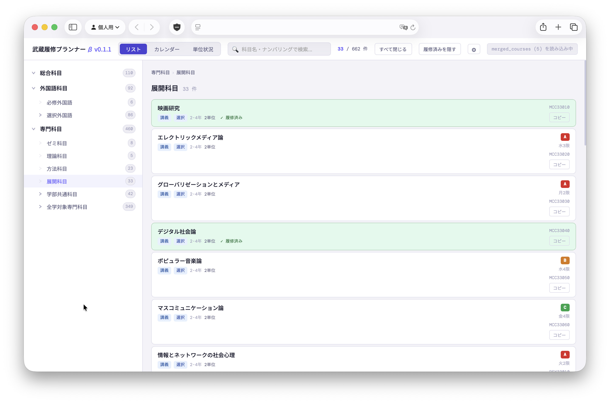
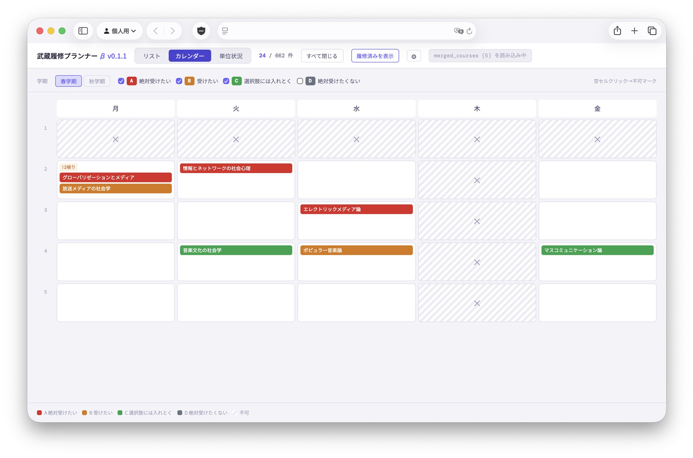
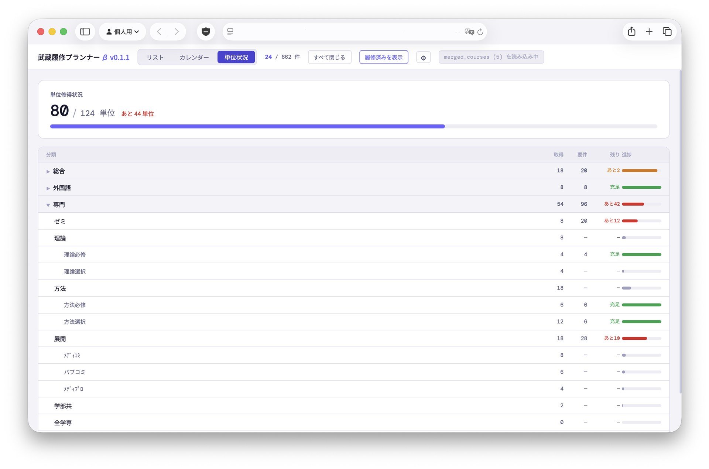
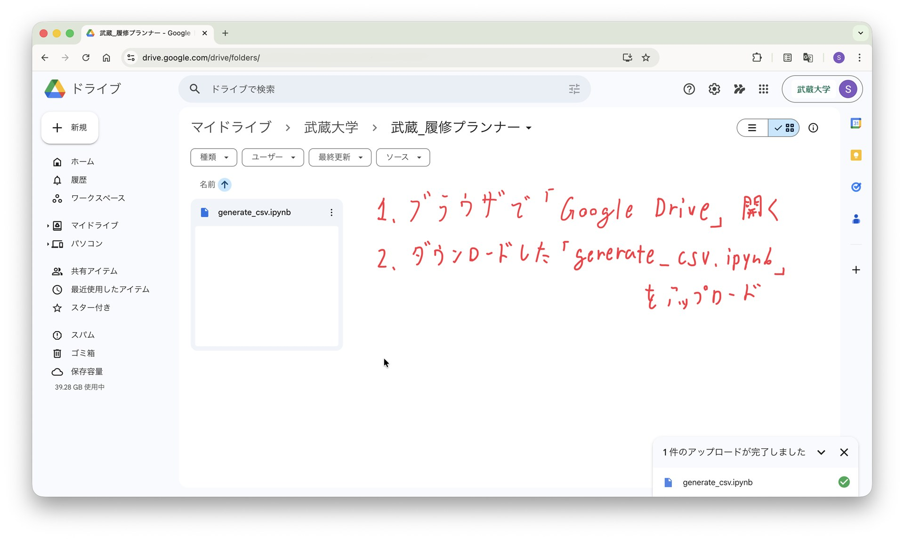
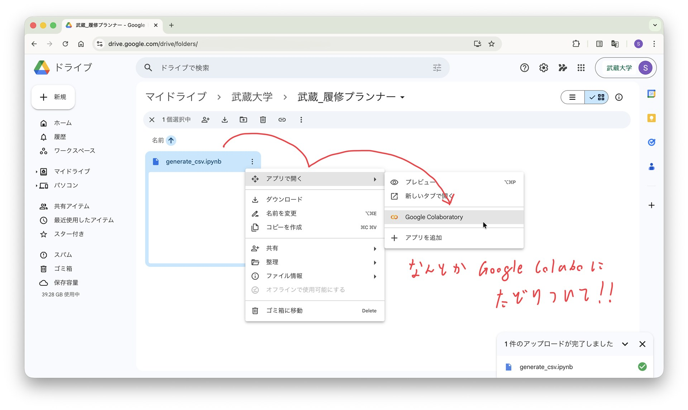
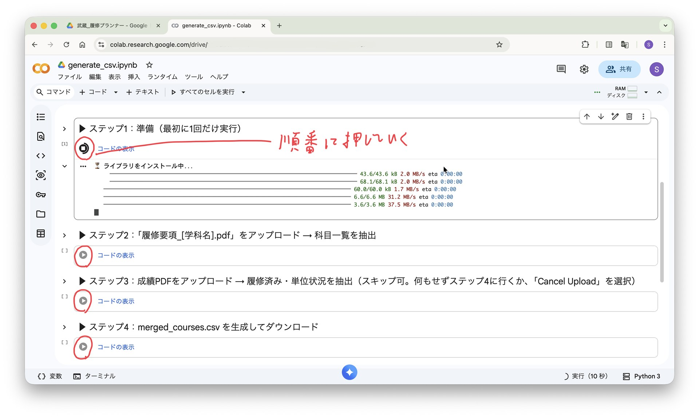
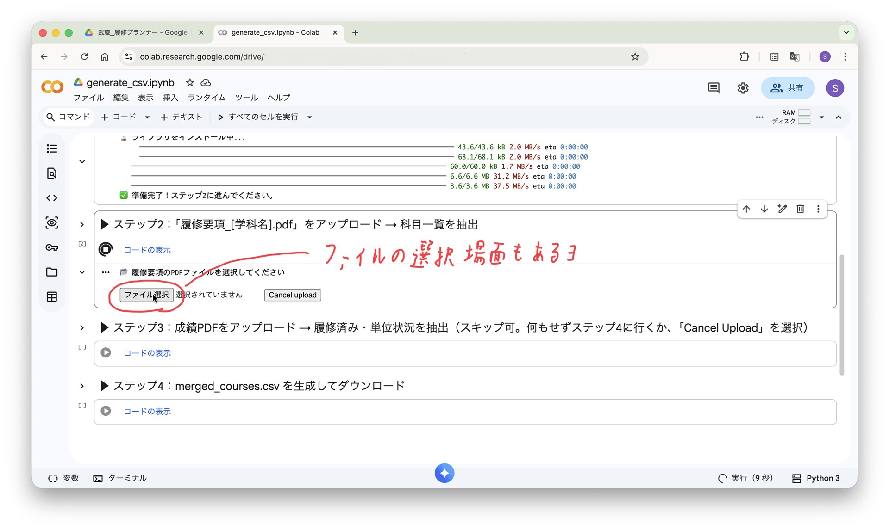

# 武蔵履修プランナー

[](https://github.com/nakahi2004/musashi-rishu-planner/releases/latest)

武蔵大生向け"非公式"の履修登録サポートツールです。履修可能な授業を一覧で表示。シラバスを確認して優先度(A〜D)や曜日・時間を入力することで、受けたい授業を週間カレンダー形式で可視化することができます。





インストール不要で使えます。メディ社3年の環境で動作を確認しています。

---

## 機能

- **リスト表示** — 大分類・中分類・小分類で科目をツリー表示。科目名・ナンバリングで検索可能
- **優先度設定** — 科目ごとにA〜Dの優先度とメモを記録が可能（ブラウザに自動保存）
  - `A` 絶対受けたい　`B` 受けたい　`C` 選択肢には入れとく　`D` 受けない/受けたくない
- **カレンダー表示** — 曜日・時間を設定した科目を週間カレンダーで確認。優先度ごとのフィルタリングに対応
- **単位状況タブ** — 取得済み・要件単位を分類ごとに一覧表示（成績PDFを使用した場合）
- **シラバスリンク** — タイルから3Sのシラバス検索ページに直接アクセス（科目名が自動でコピーされるため、「科目名」）
- **オフライン動作** — 一度開けばネット接続不要。データはすべてブラウザのlocalStorageに保存

---

## 使い方

- とにかく簡単に使い始めたい人：①だけ
- 履修済み授業を自動選択・Webアプリ内で単位取得状況を確認したい人：①→②飛ばす→③へ

### ① フォルダーをダウンロードし、Webアプリを起動

1. 上の「ダウンロード」ボタンから最新のバージョンを選択。「Assets」内の「musashi-rishu-planner.zip」をダウンロードし、解凍してください。
2. 中に入ってる「rishu-planner.html」をダブルクリックし、ブラウザ(Chrome, Edge, Safariなど)で開きます※。

※「メモ帳」などのテキストエディタでは開かないでください。文字列しか表示されません。

### ② CSVファイルを入力

とにかく簡単に使い始めたい人↓
1. Webアプリに表示された「CSVファイルを選択」から、同じフォルダ内の「Gakka」フォルダに入っているご自身が所属されている学科名のcsvファイルを開いてください。

履修済み授業を自動選択・Webアプリ内で単位取得状況を確認したい人↓
1. ②は飛ばして③に進んでください。

### ③ 成績PDFとの照合

以下の2つのファイルが必要です。

| ファイル | 入手先 |
|---|---|
| [学科名]_courses.csv（ご自身が所属する学科名のものを選択） | ダウンロードしたフォルダ内の `Gakka/` フォルダに入ってます（別途用意不要） |
| 成績PDF | [3S](https://3s.musashi.ac.jp/) → 成績タブ → 成績照会 → 右上「PDF」からダウンロード |

> 成績PDFの取り扱いについて、不安を感じると思います。下部の「個人情報の取り扱いについて」をご確認ください。

1. [generate_csv.ipynb](./generate_csv.ipynb) をGoogle Driveに保存し、右クリック。「アプリで開く」から「Google Colaboratoryで開く」を選択し、Google Colabに遷移。


2. **ステップ1〜4** を順番に実行


3. `merged_courses.csv` がダウンロードされる
4. `rishu_planner.html` をブラウザで開き、`merged_courses.csv` を読み込む


---

## ファイル構成

```
musashi-rishu-planner/
├── rishu_planner.html        # メインアプリ（CSVを読み込んで使用）
├── generate_csv.ipynb        # CSVを生成するGoogle Colabノートブック
└── Gakka/                    # 学科別 科目一覧CSVファイル（履修要項から科目を抽出）
    └── mediashakai_gakka.pdf
```

---

## 個人情報の取り扱いについて

成績PDFは、履修済みの授業を見分けるため、単位の取得状況を視覚化するために利用します。ご自身のGoogleサービス(Google Drive・Google Colab)上でのみ処理を行い、出力される「merge_courses.csv」には、成績などを除いた必要最低限の情報だけが記載されます。また、Webアプリ自体はローカル環境で実行され、情報はブラウザ内にのみ保存されます(localStorage機能を利用)。ご利用に関して、いかなるデータも制作者に送信されることも、利用されることもありません。

---

## 注意事項

- 本ツールは個人が作成した非公式ツールです。武蔵大学とは一切関係ありません
- 制作者にはプログラミングの基礎知識しかありません。本アプリは、Claude Codeを利用し制作されたもので、内部のコードについて全く把握していません。そのため、制作者・利用者の想定外の挙動をする場合があります。
- 利用に関して、制作者は何の責任も取れません。**利用は完全に自己責任**でお願いします。と脅し文句を入れてますが、手探りで頑張って作ったので、ぜひ使ってみて欲しいです。自分は使ってます。
- 履修登録の最終確認は必ず公式の履修要項・3Sで行ってください
- 動作確認はChrome(Win/Mac)・Edge(Win)・Safari(Mac)で行っています

---

## その他

連絡先:
`51_coal.mime@icloud.com`
iCloudのランダム生成メアドです。返信は別メアドから差し上げます。もし何かあれば、ご連絡お願いします。